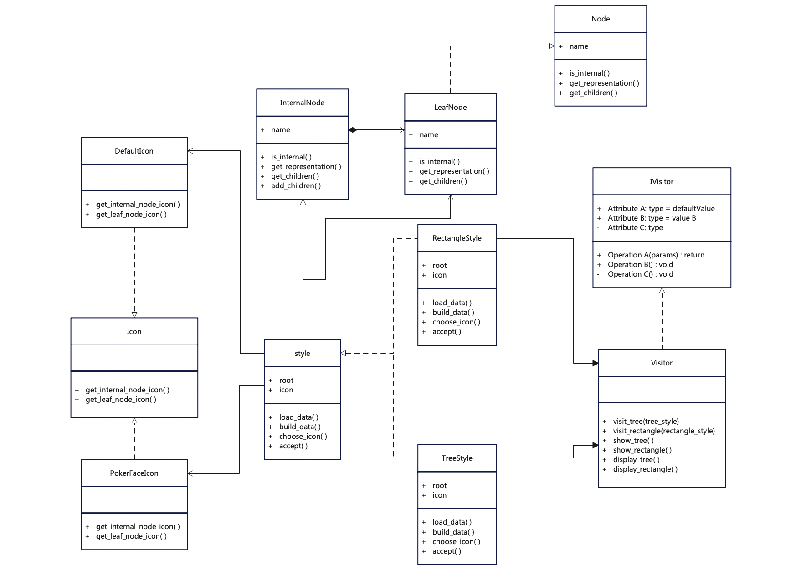
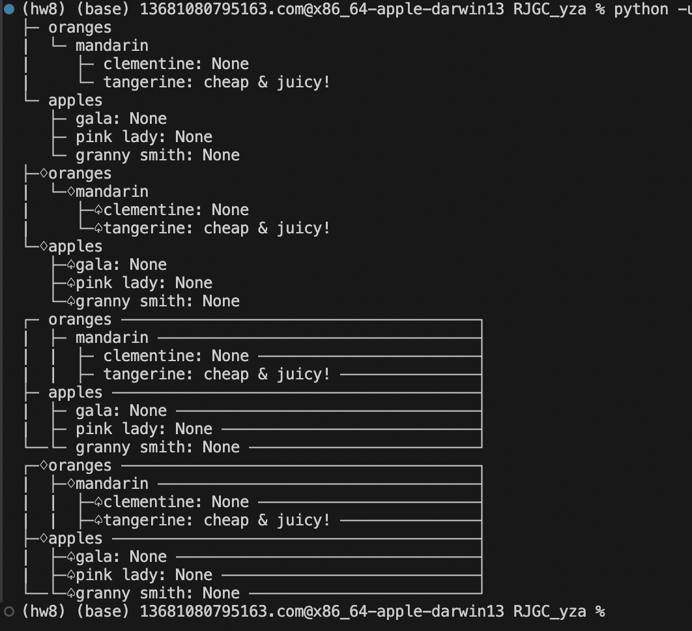

# Design Pattern 进阶

姓名:杨子昂  学号:21307181

### 一.实验题目

FJE项目迭代器+访问者模式

### 二.实验内容

#### 2.1 UML类图



从UML类图看大致可以分为以下几个部分

- 抽象类与具体实现：Style => RectangleStyle TreeStyle
- 抽象类与具体实现：Icon => PokerFaceIcon DefaultIcon
- 抽象类与具体实现：Node => InternalNode LeafNode
- 组合模式： InternalNode LeafNode
- 访问者模式：visitor -> RectangleStyle TreeStyle
- 迭代器：用于顺序访问不同的Style

由于本次实现重点在于重构迭代器+访问者模式，下面便对这两部分进行解释和分析

#### 2.2 迭代器

```python
# 创建style对象
    style_td = TreeStyle("test.json", "default")
    style_tp = TreeStyle("test.json", "pokerface")
    style_rd = RectangleStyle("test.json", "default")
    style_rp = RectangleStyle("test.json", "pokerface")

    #将这些对象放入列表中
    styles = [style_td, style_tp, style_rd, style_rp]

    # 创建迭代器
    iterator = iter(styles)

    visitor = Visitor()

    while True:
        try:
            style = next(iterator)
            style.accept(visitor)
        except StopIteration:
            break
```

创建所需要的四种对象，然后将其放在列表内，使用迭代器进行顺序访问，并调用接受访问者的函数。

#### 2.3 访问者模式

```python
#定义访问者接口
class IVisitor(ABC):
    @abstractmethod
    def visit_tree(self, tree_style):
        pass

    @abstractmethod
    def visit_rectangle(self, rectangle_style):
        pass

#实现访问者类
class Visitor(IVisitor):
    def visit_tree(self, tree_style):
        self.show_tree(tree_style)

    def visit_rectangle(self, rectangle_style):
        self.show_rectangle(rectangle_style)

    def show_tree(self, tree_style):

    def display_tree(self, node: Node, level: int, is_last_child: List[bool], tree_style):

    def show_rectangle(self, rectangle_style) -> None:

    def display_rectangle(self, node: Node, level: int, is_last_child: List[bool], is_head, rectangle_style):
```

定义访问者，访问者通过接受style对象来进行访问，并调用其中的show和display函数进行对应的json文件可视化。

**接受访问**
style对象需要定义accept函数来接受访问者对象的访问，有下面代码进行实现。

```python
class TreeStyle(Style):
    def __init__(self, file_name: str, icon_style: str):
        super().__init__(file_name, icon_style)
    def accept(self, visitor: IVisitor):
        visitor.visit_tree(self)


class RectangleStyle(Style):
    def __init__(self, file_name: str, icon_style: str):
        super().__init__(file_name, icon_style)

  

    def accept(self, visitor: IVisitor):
        visitor.visit_rectangle(self)
```

当对象调用accept函数时，表明接受访问者的访问请求，接着调用相应的visit进行具体的访问操作，从而输出json文件的可视化。

### 三. 结果



结果是正确的。
